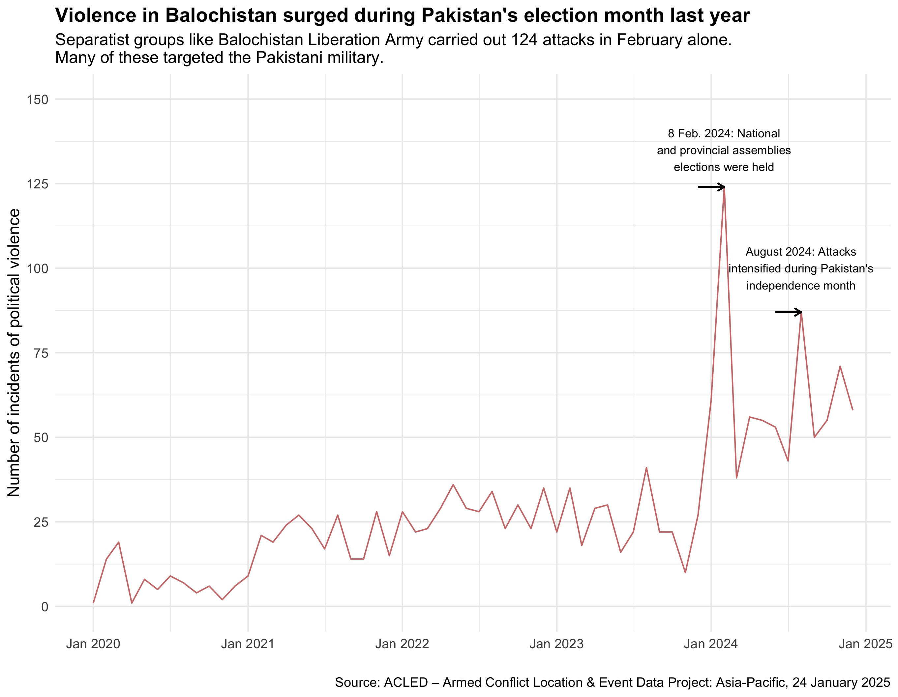

# In One Chart: Violence in Balochistan  
📊 **Visualizing Separatist Attacks in Balochistan (2020-2024)**  

## Overview  
This repository contains the dataset, R code, and visualization for my **"In One Chart"** assignment, which examines the **rise in separatist violence in Balochistan** over the past few years. Using data from the **Armed Conflict Location & Event Data Project (ACLED)**, this analysis highlights key trends, particularly **spikes in violence during Pakistan's 2024 general elections** and **Independence Month (August 2024).**    

## Data  
The dataset (`balochistan_cleaned_all.csv`) consists of **monthly incident counts** of separatist attacks in Balochistan from **2020 to 2024**. The data includes:  

- 📅 **Date (Month-Year)**  
- 🔥 **Number of Violent Incidents**  
- 🎯 **Event Type**  
- 📍 **Geographical Coordinates**  

**📌 Source:** [ACLED – Armed Conflict Location & Event Data Project](https://acleddata.com/)  

## How I did it?
-Used **pandas** to clean a larger dataset from ACLED containing data from 2018 till January 2025 of all regions in Asia Pacific.**
-Further cleaned Balochistan data to get just the month and number of attacks.**
-Used **R** for visualizations.**

### ⚠️ Context:  
- Baloch separatist groups, such as the **Balochistan Liberation Army (BLA)**, primarily target **Pakistani military personnel**  
- The conflict has **deep historical roots**, linked to demands for **autonomy and resource control**  

## Code & Visualization  
The primary R script (`balochistan_analysis.R`) generates the chart using **ggplot2**. 

